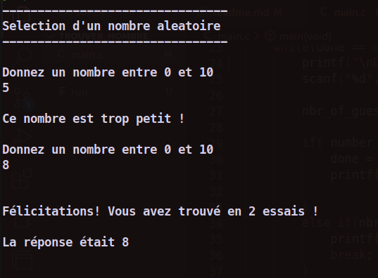

## Ce programme choisit un nombre de façon aleatoire et demande a l'utilisateur de le retrouver.

*** Compiler: ***

```
git clone https://github.com/ciskoinch8/le-nombre-mystere.git
```
```
cd le-nombre-mystere
```

```
gcc -Wall -o run main.c
```

```
./run
```

### output:

